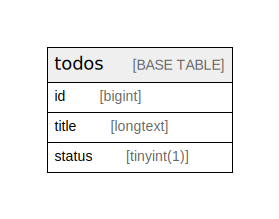

# bubble

## Tables

| Name | Columns | Comment | Type |
| ---- | ------- | ------- | ---- |
| [todos](todos.md) | 3 |  | BASE TABLE |

## Stored procedures and functions

| Name | ReturnType | Arguments | Type |
| ---- | ------- | ------- | ---- |
| film_in_stock |  | p_film_id int; p_store_id int; p_film_count int | PROCEDURE |
| film_not_in_stock |  | p_film_id int; p_store_id int; p_film_count int | PROCEDURE |
| get_customer_balance | decimal | p_customer_id int; p_effective_date datetime | FUNCTION |
| inventory_held_by_customer | int | p_inventory_id int | FUNCTION |
| inventory_in_stock | tinyint | p_inventory_id int | FUNCTION |
| rewards_report |  | min_monthly_purchases tinyint; min_dollar_amount_purchased decimal; count_rewardees int | PROCEDURE |

## Relations

---

> Generated by [tbls](https://github.com/k1LoW/tbls)
